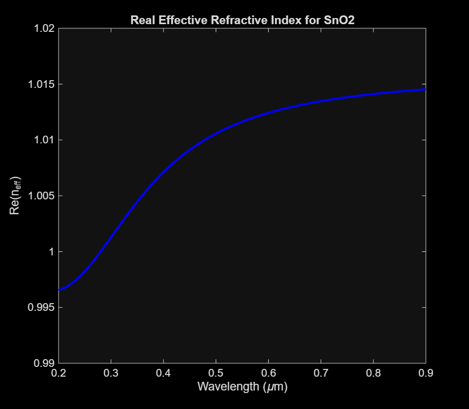

# Nanoparticle Effective Refractive Index
This is a program that calculates the effective refractive index of a nanoparticle using Maxwell-Garnett theory.
The input parameters are nanoparticle radius (b) [nm] and material, the magnitude of magnetic flux density (B) [T] applied to nanoparticle, and the range of wavelengths. 
The output is the effective refractive index at each wavelength. [1]
The Refractive Index Simulation function is adapted from the Absorption Simulation function by Kenzie Lewis and Raaja Rajeshwari Manickam, based off algorithm by Dani et al. [2]

## Before simulation
Make sure the fitted parameters (for SnO2, Fe2O3, Au, or other materials) are up to date with the most recent experimental data.
All the units are SI and the angles are in radians.

## Running the simulation
Run the function in the Get Refractive Index file, a script that formats the outputs in an excel table and MATLAB plots. Two separate plots are returned for the effective refractive index (n_eff) and extinction coefficient (k).
   

# References
[1] D. Griffiths, Introduction to Electrodynamics, 4th Edition ed. (2017). \
[2] R.K. Dani, H. Wang, S.H. Bossmann, G. Wysin, and V. Chikan, “Supplemental Material for "Faraday rotation enhancement of gold coated Fe2O3 nanoparticles: Comparison of experiment and theory," ” J. Chem. Phys. 135(22), 224502 (2011). \
[3] A. Ibrahim, “Synthesis and Characterization of Magnetic Nanoparticles to Incorporate into Silicon Waveguides to be Used as Optical Isolators,” M.S. thesis, Eng. Phys., McMaster Univ., Hamilton, Ontario, 2019. [Online]. Available: https://macsphere.mcmaster.ca/bitstream/11375/24720/2/Ibrahim_Amr_E_201908_MASc.pdf 

